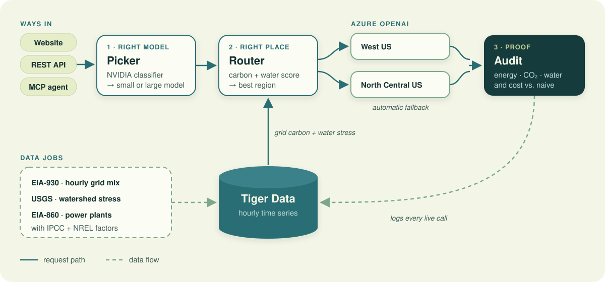

# Green Router

**Same answers. Smaller footprint.**

Green Router sends every AI call to the **lightest model that can handle it** and the **greenest Azure region that can run it**, then audits the energy, carbon and water each call used. It was built at MHacks 2026 for the Sustainability track.

**Live demo:** [green-router.vercel.app](https://green-router.vercel.app)

---

## Why

- **Inference now dominates AI's energy use.** At Google, inference was already about 60% of AI energy, and estimates from NVIDIA and AWS put it at 80–90% of AI workloads.
- **Most calls are oversized.** In the RouteLLM study, only about 14% of queries actually needed the strong model.
- **Where a call runs matters.** The same request has a different carbon and water cost depending on the region's grid mix and how stressed the local watershed is that hour.

Existing routers (Azure Model Router, OpenRouter, LiteLLM) choose models for **cost, quality and latency**. None of them optimize for carbon or water, choose *where* a call runs, or audit its impact. Green Router does all three.

## What it does

| | Feature | How |
|---|---|---|
| 1 | **Right model** | A prompt-complexity classifier sends simple prompts to the small model (`gpt-4.1-mini`) and keeps the large one (`gpt-5-mini`) for demanding work. An Eco ↔ Quality setting shifts the cutoff. |
| 2 | **Right place** | Hourly grid carbon (EIA) and watershed stress (USGS) decide which Azure region runs each call. A carbon ↔ water slider sets the priority. Live calls are sent for you, with automatic fallback to the other region. |
| 3 | **Proof** | Every live call is audited: energy, CO₂, water, stress-weighted water and cost, compared with the naive setup (large model in the default region), from Azure's real token counts. |

It's available three ways: a **website**, a **REST API**, and an **MCP server** so AI agents can use it as a tool.

## Results

Measured on real Azure calls during the hackathon, against the naive setup (`gpt-5-mini` in North Central US):

| | Result |
|---|---|
| Simple prompt, sent to `gpt-4.1-mini` in West US | **77% less energy · 77% less CO₂ · 88% less water · 14% cheaper** |
| Complex prompt, kept on `gpt-5-mini` | No energy saved (it needed the large model), but routing alone cut water by **49%** |
| Hand-labeled test set (10 prompts) | **6 of 10** went to the small model; simple prompts 5/5 correct, complex prompts 4/5 |
| Projected | about **975 kWh** saved per 1M prompts with the same mix |

Energy figures rely on published per-token estimates (see [Data and methodology](#data-and-methodology)), so treat them as estimates, not meter readings.

## How it works



1. **Picker** (`greenrouter/picker.py`, `nvidia_model.py`): scores the prompt with NVIDIA's [prompt-task-and-complexity-classifier](https://huggingface.co/nvidia/prompt-task-and-complexity-classifier) (DeBERTa-v3, about 184M parameters). Its `constraint_ct` score against a cutoff of 0.70, chosen on 42 hand-labeled prompts, decides small vs. large. The model versions are pinned.
2. **Router** (`router.py`, `scoring.py`): scores each region on grid carbon and stress-weighted water, normalizes them, applies the carbon/water weights and turns the scores into traffic shares with a softmax. `/route` returns the split for a batch; a single live call goes to the best region, with the other as fallback.
3. **Grid data** (`scoring.grid_at`): reads hourly data from Tiger Data, falling back from live → last 6 hours → same hour yesterday → typical value for that hour → static estimate. EIA publishes with about a day's delay, so the fallbacks matter.
4. **Audit** (`accounting.py`): converts Azure's real token counts into energy, CO₂, water and cost, compares them with the naive baseline, and logs each call to Tiger Data in the background. Prompts are never stored.

## Data and methodology

| Input | Source |
|---|---|
| Grid carbon (gCO₂/kWh) | EIA-930 hourly generation by fuel, per balancing authority (West US → CAISO, North Central US → PJM), with IPCC AR5 lifecycle emission factors per fuel |
| Generation water (L/kWh) | NREL (Macknick et al. 2012) consumptive water factors per fuel |
| Watershed stress (0–1) | USGS monthly consumption ÷ streamflow for the data center's HUC12 watershed, plus the watersheds of the main power plants feeding each grid (EIA-860) |
| Model energy per token | Jegham et al. 2025, "How Hungry is AI?" (arXiv:2505.09598). `gpt-4.1-mini` isn't reported separately, so GPT-4o's figure is used as a conservative upper bound. |
| Data center efficiency | Microsoft Americas FY25: PUE 1.16, WUE 0.34 L/kWh (published by geography, not by region) |

**Water impact** = liters × watershed stress. A liter taken from a stressed watershed counts for more than one from a healthy one. The site shows both physical liters and water impact.

Estimates *before* a call (Step 1 on the website) use an approximate prompt token count and an assumed answer length per complexity. Live calls use Azure's real token counts.

## API

All endpoints are JSON. Interactive docs are at `/docs` when `GREENROUTER_ENV=dev`.

| Method | Path | What it returns |
|---|---|---|
| `GET` | `/health` | `{"ok": true}` |
| `POST` | `/pick-model` | Recommended model, complexity, token estimate and estimated savings for one prompt. Optional `user_preference` (0 = max eco, 0.5 = default, 1 = max quality) and `simplification_mode` (`structural` or `none`). |
| `POST` | `/pick-model/batch` | The same for up to 50 prompts in one model pass |
| `POST` | `/route` | Traffic split across regions for `num_calls` and carbon/water `weights`, with per-region data and savings vs. the naive region |
| `POST` | `/complete` | **Live call** (spends Azure credits). Requires the `X-Demo-Token` header. Picks the model and region, calls Azure, and returns the answer plus an `impact` audit. |
| `GET` | `/summary?hours=24` | Totals from logged live calls: actual vs. baseline |
| `GET` | `/regions` | Current per-region carbon, water, watershed and contributing power plants |
| `GET` | `/replay?hours=24` | Hourly carbon and water per region, and which region won each hour |

Example:

```bash
curl -X POST http://localhost:8000/pick-model \
  -H 'Content-Type: application/json' \
  -d '{"prompt": "What is the capital of Australia?"}'
```

## MCP server

`mcp_server/server.py` exposes Green Router to AI assistants and agents over MCP. Every tool is read-only, and none of them can make paid live calls.

| Tool | Purpose |
|---|---|
| `pick_model` | Lightest model for one prompt, with savings |
| `pick_models` | Same for up to 50 prompts |
| `route_calls` | Region split for a batch, with each region's carbon and water |
| `savings_so_far` | Real savings from logged live calls |
| `region_snapshot` | Why one region is preferred right now |
| `grid_replay` | How the best region changed over recent hours |

Add it to Claude Code (from the repo root, with the backend running):

```bash
claude mcp add green-router -- "$PWD/.venv/bin/python" "$PWD/mcp_server/server.py"
```

Set `GREENROUTER_URL` to point it at a backend other than `http://localhost:8000`.

## Running locally

Requirements: Python 3.11+, Node 20+.

**Backend**

```bash
python3 -m venv .venv
.venv/bin/pip install -r requirements.txt
cp .env.example .env        # fill in values; never commit .env
.venv/bin/uvicorn greenrouter.main:app --port 8000 --env-file .env
```

The first start downloads the picker model from Hugging Face (about 1 GB). Afterwards, set `HF_HUB_OFFLINE=1` so it never downloads at runtime.

**Website**

```bash
cd frontend
npm install
npm run dev                 # http://localhost:5173
```

The website reads the backend address from `VITE_API_URL` (default `http://localhost:8000`). This value is public, so never put keys in `VITE_*` variables.

**MCP server**

```bash
.venv/bin/pip install -r mcp_server/requirements.txt
```

**Smoke test**

```bash
python tools/smoke_test.py --no-live    # everything except paid Azure calls
python tools/smoke_test.py              # also makes 2 real calls
```

### Configuration (`.env`)

| Variable | Purpose |
|---|---|
| `WESTUS_ENDPOINT`, `WESTUS_KEY`, `NCUS_ENDPOINT`, `NCUS_KEY` | Azure OpenAI resources (endpoint format `https://<name>.openai.azure.com/openai/v1/`) |
| `SMALL_DEPLOYMENT`, `LARGE_DEPLOYMENT` | Azure deployment names (`gpt-4.1-mini`, `gpt-5-mini`) |
| `DEMO_TOKEN` | Required for `/complete`; live calls stay off unless it is 20+ characters |
| `MAX_LIVE_CALLS_PER_DAY` | Global cap on live calls (default 200) |
| `TIGER_DSN` | Tiger Data connection string (include `sslmode=require`) |
| `EIA_API_KEY` | Only needed to run the EIA ingest job |
| `ALLOWED_ORIGINS` | Comma-separated website origins allowed to call the API (CORS) |
| `TRUSTED_PROXY_HOPS` | Set to `1` behind one proxy or tunnel; `0` locally |
| `GREENROUTER_ENV` | `dev` turns on `/docs`; leave empty in production |
| `HF_HUB_OFFLINE` | `1` after the model is downloaded |

### Data pipeline (Tiger Data)

Run once to set up the database, from the repo root:

```bash
psql "$TIGER_DSN" -f db/schema.sql
psql "$TIGER_DSN" -f db/migration_002_water.sql
python -m jobs.load_water --combined <USGS file>             # site watershed stress
python -m jobs.load_plants --plants <EIA-860 plants xlsx> \
    --generators <EIA-860 generators xlsx> --combined <USGS file>   # power-plant watersheds
python -m jobs.eia_ingest --days 365                           # backfill a year of grid data
```

Then run `python -m jobs.eia_ingest --days 3` regularly (it's safe to re-run) to keep grid data fresh. Each job's docstring explains where to download its input files.

## Security

- **Secrets stay server-side:** keys, the demo token and the database connection string come only from environment variables, never from code, git or the website.
- **Live calls are guarded:** they're off unless `DEMO_TOKEN` is set. The rate limit is checked before the token (to slow guessing), at 5 per minute per client, with a global daily cap and at most 1,000 completion tokens per call.
- **Limits on every endpoint:** request size (64 KB), per-client rate limits (60/min overall, 30/min for the picker, 6/min for batches), strict input validation and restricted CORS.
- **Azure keys go only to `*.openai.azure.com` over HTTPS.** Upstream errors are never returned to clients.
- **No secrets in logs:** prompts are never logged or stored. The EIA key and database details are kept out of error messages.
- **The website ships security headers** (Content Security Policy, no framing, no referrer) and renders model output as plain text only.
- **Model versions are pinned** to the tested Hugging Face commits.

## Deployment

The current demo runs the **website on Vercel** and the **backend on a laptop**, exposed through a Cloudflare tunnel. For an always-on deployment, host the backend on a machine with about 2 GB of RAM (the picker model needs it), then set `VITE_API_URL` on Vercel and `ALLOWED_ORIGINS`/`TRUSTED_PROXY_HOPS` on the backend.

```bash
cd frontend
npx vercel deploy --prod --build-env VITE_API_URL=<backend URL>
```

## Project structure

```
greenrouter/        FastAPI backend
  main.py           endpoints, security, rate limits, live-call guards
  picker.py         model choice (cutoff, eco/quality preference, batch)
  nvidia_model.py   NVIDIA prompt-complexity classifier (pinned)
  tokens.py         token estimates before a call
  router.py         region split and savings vs. naive routing
  scoring.py        carbon/water scoring, Tiger Data reads with fallbacks
  accounting.py     per-call impact audit and logging
  dashboard.py      /summary, /regions, /replay
  azure_client.py   Azure OpenAI calls
  regions.py        regions and static fallback values
  schemas.py        API request/response models
frontend/           React + Vite website (Dashboard and Live demo pages)
mcp_server/         MCP server for AI agents
jobs/               data pipeline: EIA ingest, USGS water stress, EIA-860 plants
db/                 Tiger Data schema and migration
tools/              end-to-end smoke test
```

## Limitations

- Two Azure regions so far (West US and North Central US), limited by the student subscription's deployments.
- Energy per token comes from published estimates. `gpt-4.1-mini` uses GPT-4o's figure as an upper bound, which likely *understates* our savings.
- Microsoft publishes PUE and WUE by geography, so both regions share the Americas values.
- Answer length before a call is an assumption, so Step 1's savings are estimates; live calls use real counts.
- The picker's cutoff was chosen on a small hand-labeled set (42 prompts). The labels are judgment calls, not ground truth.

## What's next

- Every Azure region in the US, then international regions
- AWS and Google Cloud alongside Azure
- Anthropic and more OpenAI models

---

Built at MHacks 2026, October 3–4, 2026, in Ann Arbor, Michigan.
